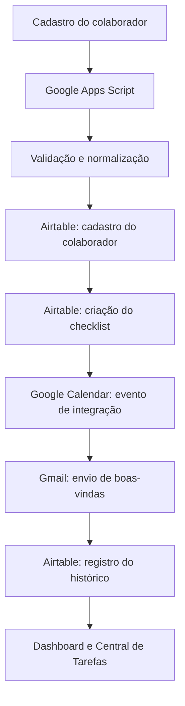
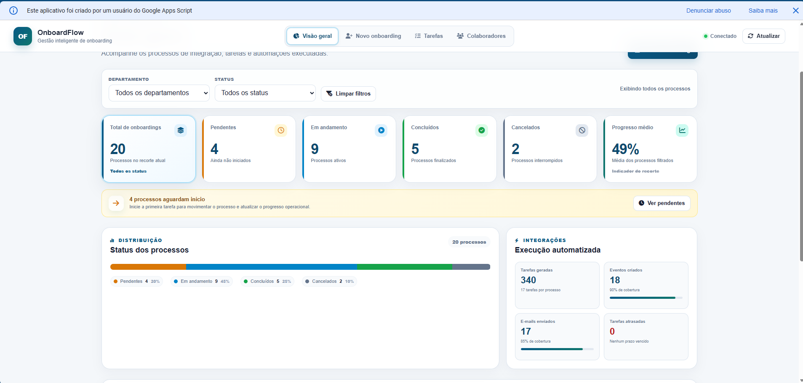
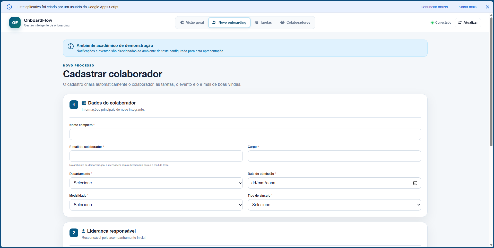
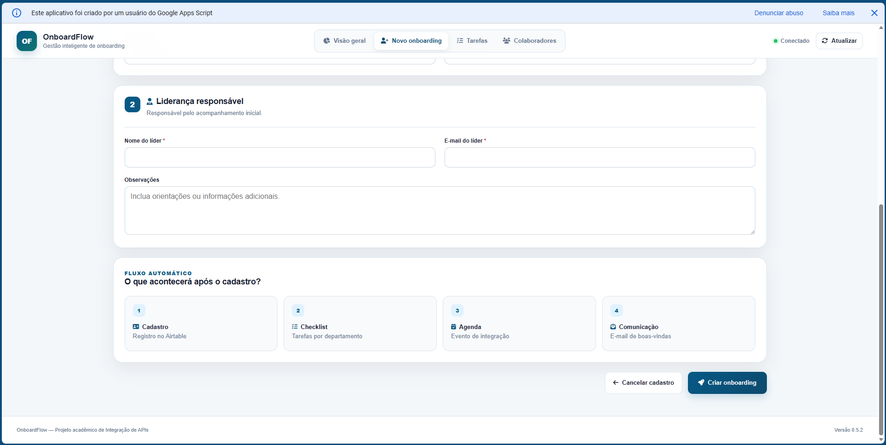
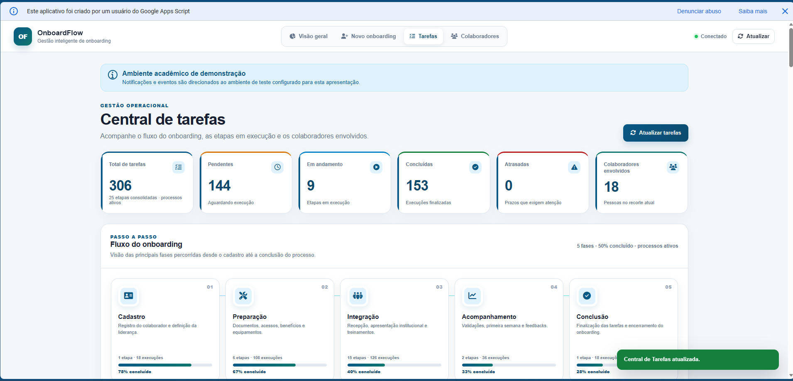
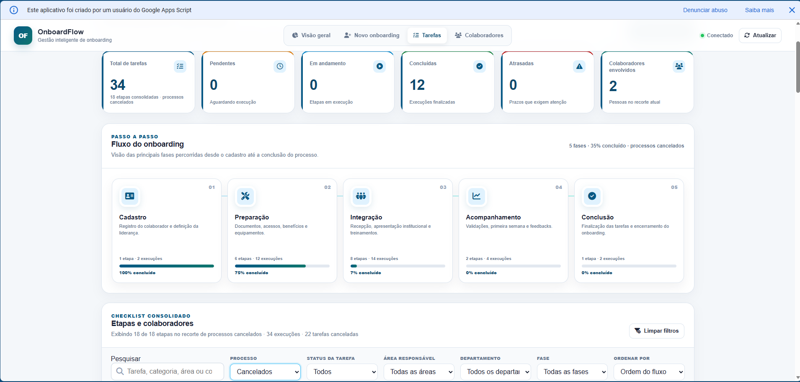
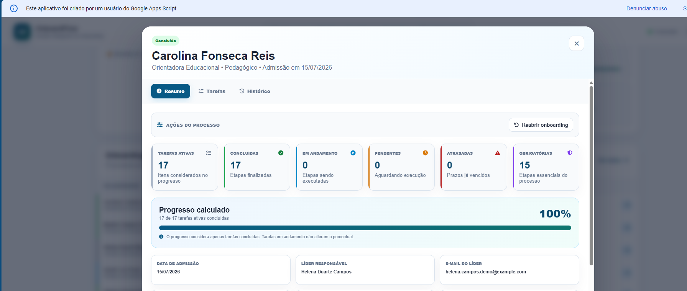
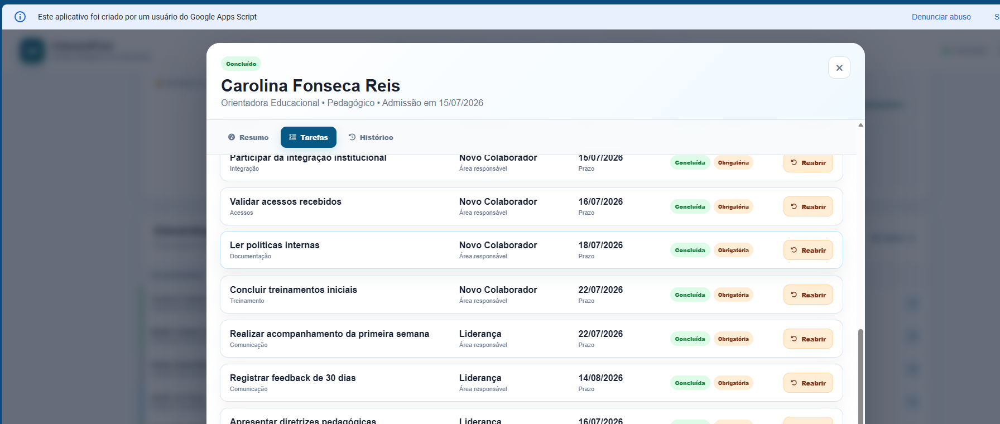

# OnboardFlow

**Gestão inteligente de onboarding com integração de APIs**  
**Versão final:** `0.5.2` · **Status:** concluído

| Informação acadêmica | Dados |
|---|---|
| Curso | Graduação IA e Automação Digital |
| Disciplina | Integração de APIs |
| Aluno | Anderson Barbosa Marques da Silva |
| RA | 16732 |

## Acesso ao projeto

- **Aplicação publicada:** [Abrir o OnboardFlow](https://script.google.com/macros/s/AKfycbyByk9qiePzbytPUhTBo68gpczfhP7cAxuBqfGADdynA1w4ae6v-Rr0lUctJkrMj6tU/exec)
- **Código-fonte:** [Acessar este repositório](https://github.com/AndyMarksss/OnboardFlow)

> O Web App foi publicado no Google Apps Script e validado em janela anônima. As credenciais de integração não fazem parte deste repositório e permanecem armazenadas nas Propriedades do Script.

## Sobre o projeto

O **OnboardFlow** é uma aplicação web criada para centralizar, automatizar e acompanhar o processo de integração de novos colaboradores. A solução conecta **Google Apps Script**, **Airtable**, **Gmail** e **Google Calendar** em um único fluxo operacional.

A partir de um cadastro, o sistema registra o colaborador, gera o checklist correspondente ao departamento, prepara o evento de integração, envia a comunicação de boas-vindas e mantém um histórico das automações. A interface permite acompanhar indicadores, tarefas, progresso, processos cancelados e os colaboradores vinculados a cada etapa.

## Problema solucionado

Em processos manuais, as informações de onboarding costumam ficar distribuídas entre planilhas, e-mails, agendas e controles isolados. Isso pode gerar tarefas esquecidas, falta de visibilidade, atrasos na preparação de acessos e equipamentos, comunicação inconsistente e ausência de histórico.

O OnboardFlow transforma esse processo em um fluxo centralizado, rastreável e orientado por dados.

## Principais funcionalidades

- cadastro de novos colaboradores e liderança responsável;
- persistência dos dados no Airtable;
- geração automática de tarefas comuns e específicas por departamento;
- cálculo de progresso por colaborador;
- dashboard com indicadores e distribuição de status;
- Central de Tarefas com cinco macrofases do onboarding;
- consulta dos colaboradores vinculados a cada tarefa;
- filtros por processo, status, área, departamento e fase;
- gestão de tarefas: iniciar, concluir e reabrir;
- cancelamento, reativação e reabertura de onboardings;
- criação de evento no Google Calendar;
- envio controlado de e-mail de boas-vindas pelo Gmail;
- registro do histórico de automações;
- exportação de colaboradores em CSV;
- interface responsiva, acessível e baseada em Font Awesome.

## APIs e serviços integrados

| Integração | Finalidade | Implementação |
|---|---|---|
| Airtable REST API | Armazenar colaboradores, tarefas, configurações e automações | `UrlFetchApp` com autenticação Bearer |
| Gmail | Enviar a comunicação de boas-vindas e controlar duplicidades | `GmailApp` |
| Google Calendar | Criar e acompanhar o evento de integração | `CalendarApp` |
| Google Apps Script | Orquestrar regras, segurança, interface e publicação | JavaScript V8 e HTML Service |

## Fluxo de integração



## Arquitetura

```text
Interface Web
├── Index.html
├── Styles.html
└── Scripts.html
        │
        ▼
Google Apps Script
├── Code.gs
├── WebAppService.gs
├── OnboardingService.gs
├── OnboardingManagementService.gs
├── TaskCenterService.gs
├── AirtableService.gs
├── CalendarService.gs
├── GmailService.gs
└── AutomationLogService.gs
        │
        ├── Airtable REST API
        ├── Gmail
        └── Google Calendar
```

## Fluxo do onboarding

A Central de Tarefas organiza o processo em cinco macrofases:

1. **Cadastro** — documentação admissional e definição da liderança;
2. **Preparação** — benefícios, acessos, contas e equipamentos;
3. **Integração** — recepção, apresentação institucional e treinamentos;
4. **Acompanhamento** — validações, primeira semana e acompanhamento;
5. **Conclusão** — feedback de 30 dias e encerramento do processo.

A configuração final possui **25 etapas consolidadas**, formadas por 16 tarefas comuns e 9 tarefas específicas por departamento. Cada onboarding recebe normalmente 17 tarefas.

## Resultados validados

| Indicador | Resultado |
|---|---:|
| Total de onboardings | 20 |
| Pendentes | 4 |
| Em andamento | 9 |
| Concluídos | 5 |
| Cancelados | 2 |
| Progresso médio | 49% |
| Tarefas geradas | 340 |
| Processos ativos | 18 |
| Tarefas de processos ativos | 306 |
| Processos cancelados | 2 |
| Tarefas de processos cancelados | 34 |

## Demonstração visual

### Visão geral



### Cadastro de um novo onboarding



### Fluxo automático após o cadastro



### Central de Tarefas — processos ativos



### Central de Tarefas — processos cancelados



### Resumo individual do onboarding



### Checklist individual



## Modelo de dados no Airtable

- **Colaboradores:** dados pessoais e profissionais necessários ao onboarding, liderança, status e progresso.
- **Tarefas:** título, colaborador relacionado, área responsável, categoria, prazo, status, obrigatoriedade e ordem.
- **Automações:** registros de ações, resultados, mensagens e identificadores externos.
- **Configurações:** catálogo de tarefas comuns e específicas por departamento.

## Estrutura do repositório

```text
OnboardFlow/
├── appsscript/
│   ├── AirtableService.gs
│   ├── AutomationLogService.gs
│   ├── CalendarService.gs
│   ├── Code.gs
│   ├── DemoDataService.gs
│   ├── GmailService.gs
│   ├── Index.html
│   ├── OnboardingManagementService.gs
│   ├── OnboardingService.gs
│   ├── Scripts.html
│   ├── Styles.html
│   ├── TaskCenterService.gs
│   ├── WebAppService.gs
│   └── appsscript.json
├── assets/
│   └── prints/
├── docs/
├── .gitignore
└── README.md
```

## Configuração protegida

As integrações utilizam propriedades privadas configuradas em **Configurações do projeto > Propriedades do script**:

```text
AIRTABLE_TOKEN
AIRTABLE_BASE_ID
AIRTABLE_TABLE_COLABORADORES
AIRTABLE_TABLE_TAREFAS
AIRTABLE_TABLE_AUTOMACOES
AIRTABLE_TABLE_CONFIGURACOES
GOOGLE_CALENDAR_ID
ONBOARDFLOW_EMAIL_TESTE
GMAIL_LABEL_ONBOARDFLOW
```

Os valores dessas propriedades não são publicados no GitHub.

## Execução local com clasp

```bash
npm install -g @google/clasp
clasp login
clasp push --force
```

A implantação é realizada no Google Apps Script como **Aplicativo da Web**, utilizando a URL final terminada em `/exec`.

## Segurança, ética e governança

- credenciais fora do código-fonte;
- validação de campos, e-mails, datas e identificadores;
- tratamento de respostas HTTP e erros de integração;
- separação entre configurações, dados operacionais e logs;
- ambiente acadêmico com destinatário de teste;
- preservação do histórico de processos cancelados;
- exclusão dos cancelados dos indicadores operacionais por padrão;
- minimização dos dados usados no fluxo;
- ausência de tokens e segredos no repositório.

Para uso produtivo com dados reais, devem ser acrescentadas políticas formais de acesso, retenção, descarte e responsabilidades de tratamento conforme a LGPD.

## Validação realizada

A versão final foi validada quanto a:

- acesso público ao Web App em janela anônima;
- cadastro e persistência no Airtable;
- geração de checklist;
- criação de evento e comunicação;
- atualização de tarefas e progresso;
- filtros da Central de Tarefas;
- separação entre processos ativos e cancelados;
- consulta de colaboradores por etapa;
- integridade dos indicadores finais.

## Histórico resumido

| Versão | Evolução principal |
|---|---|
| 0.4.7 | Interface consolidada e base de apresentação |
| 0.5.0 | Central de Tarefas e fluxo por macrofases |
| 0.5.1 | Classificação determinística das etapas |
| 0.5.2 | Separação operacional entre processos ativos e cancelados |

## Autor

**Anderson Barbosa Marques da Silva**  
Graduação IA e Automação Digital · Integração de APIs  
RA: 16732

## Finalidade

Projeto desenvolvido para fins acadêmicos e de portfólio. O uso com dados pessoais reais exige revisão adicional de segurança, privacidade, governança e controle de acesso.
